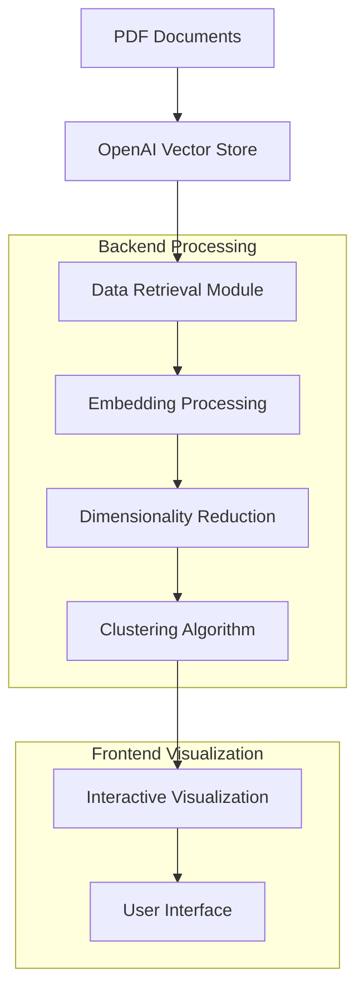
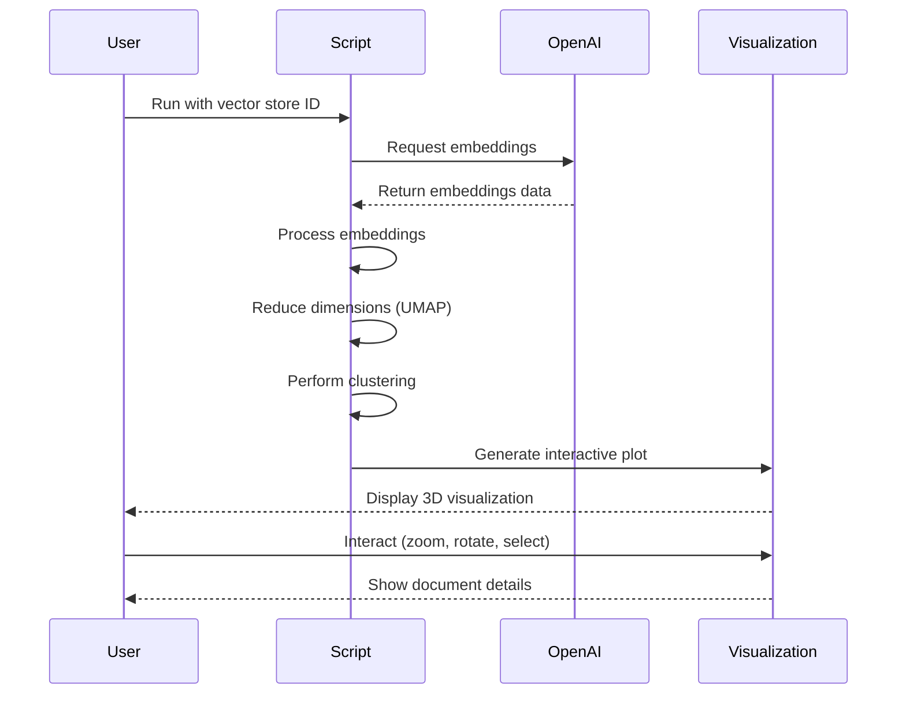
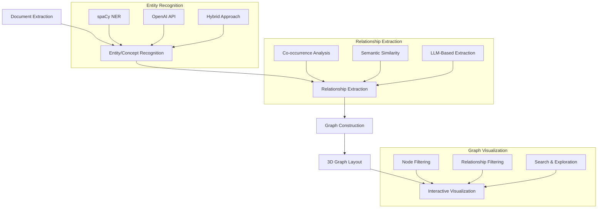

# OpenAI File Search Implementation with Vector Store Visualization

This project implements the OpenAI Responses API file search tool for semantic search on PDF documents, along with 3D visualization of vector store embeddings. It's based on the sample code that demonstrates using vector stores to search and answer questions from PDF content.

## Features

- Create vector stores on OpenAI
- Upload PDFs to the vector store
- Perform standalone vector searches
- Integrate search results with LLM responses
- Generate evaluation questions from PDFs
- Evaluate retrieval performance with metrics
- Visualize vector store embeddings in 3D space
- Explore semantic relationships between documents
- Cluster similar documents automatically

## Prerequisites

- Python 3.8+
- OpenAI API key

## Installation

1. Clone this repository
2. Install the required dependencies:
   ```
   pip install -r requirements.txt
   ```
3. Set up your environment variables:
   - Copy `.env.example` to `.env`
   - Add your OpenAI API key to the `.env` file:
     ```
     OPENAI_API_KEY=your-api-key-here
     ```
   - Optionally, configure other variables in the `.env` file

## Environment Variables

The following environment variables can be set in the `.env` file:

- `OPENAI_API_KEY`: Your OpenAI API key (required)
- `VECTOR_STORE_ID`: ID of an existing vector store (optional)
- `OPENAI_MODEL`: Model to use for LLM searches (default: gpt-4o-mini)
- `MAX_RESULTS`: Number of results to retrieve (default: 5)

These variables can also be overridden via command-line arguments.

## Usage

The implementation is provided as a Python module with a command-line interface:

### 1. Create a Vector Store

```
python search_api_implementation.py --action create_store --store_name "my_pdf_store" --output store_details.json
```

### 2. Upload PDFs to the Vector Store

```
python search_api_implementation.py --action upload --store_id "vs_123456789" --pdf_dir "path/to/pdfs" --output upload_stats.json
```

### 3. Perform Vector Search

```
python search_api_implementation.py --action search --store_id "vs_123456789" --query "What is Deep Research?"
```

### 4. Integrated LLM Search

```
python search_api_implementation.py --action llm_search --store_id "vs_123456789" --query "What is Deep Research?" --model "gpt-4o-mini"
```

### 5. Generate Evaluation Questions

```
python search_api_implementation.py --action generate_questions --pdf_dir "path/to/pdfs" --output questions.json
```

### 6. Evaluate Retrieval Performance

```
python search_api_implementation.py --action evaluate --store_id "vs_123456789" --output questions.json --k 5 --model "gpt-4o-mini"
```

### 7. Visualize Vector Store Embeddings

## Technical Architecture



#### Using the Interactive Scripts

For a user-friendly interface, run one of the interactive scripts:

```
# Windows Command Prompt
run_visualization.bat

# PowerShell
.\run_visualization.ps1
```

#### Using the Command Line

Create a vector store, upload PDFs, and visualize in one step:

```
python visualize_vector_store.py create-and-visualize --store_name "my_store" --pdf_dir "path/to/pdfs" --output "visualization.html"
```

Visualize an existing vector store:

```
python visualize_vector_store.py visualize --store_id "vs_your_vector_store_id" --output "visualization.html"
```

Run with interactive Dash web application:

```
python visualize_vector_store.py visualize --store_id "vs_your_vector_store_id" --run_dash
```

For more details on visualization features, see `VISUALIZATION_README.md`.

## Implementation Workflow



## Project Structure

- `search_api_implementation.py`: Main implementation file
- `vector_store_visualizer.py`: Vector store visualization module
- `visualize_vector_store.py`: Command-line interface for visualization
- `run_visualization.bat`: Interactive batch script for Windows
- `run_visualization.ps1`: Interactive PowerShell script for Windows
- `example_visualization.py`: Example script demonstrating programmatic usage
- `VISUALIZATION_README.md`: Detailed documentation for visualization features
- `requirements.txt`: Python dependencies
- `README.md`: This documentation file
- `.env.example`: Template for environment variables
- `.env`: Your local environment variables (not committed to the repository)

## Example Workflow

1. Create a vector store:
   ```
   python search_api_implementation.py --action create_store --store_name "openai_blog_store" --output store_details.json
   ```

2. Upload PDFs to the vector store:
   ```
   python search_api_implementation.py --action upload --store_id "vs_67d06b9b9a9c8191bafd456cf2364ce3" --pdf_dir "C:\Users\admin\ResponsesAPI\SearchOnThis" --output upload_stats.json
   ```

3. Generate questions for evaluation:
   ```
   python search_api_implementation.py --action generate_questions --pdf_dir "C:\Users\admin\ResponsesAPI\SearchOnThis" --output questions.json
   ```

4. Evaluate retrieval performance:
   ```
   python search_api_implementation.py --action evaluate --store_id "vs_67d06b9b9a9c8191bafd456cf2364ce3" --output questions.json --k 5
   ```

5. Perform search with LLM integration:
   ```
   python search_api_implementation.py --action llm_search --store_id "vs_67d06b9b9a9c8191bafd456cf2364ce3" --query "What is Deep Research?"
   ```

6. Visualize the vector store embeddings:
   ```
   python visualize_vector_store.py visualize --store_id "vs_67d06b9b9a9c8191bafd456cf2364ce3" --output "visualization.html"
   ```

7. Run the interactive visualization dashboard:
   ```
   python visualize_vector_store.py visualize --store_id "vs_67d06b9b9a9c8191bafd456cf2364ce3" --run_dash
   ```

## Notes

- The API key is required for all operations
- Vector store IDs should be saved after creation for later use
- All PDF files in the specified directory will be processed
- Evaluation metrics include Recall, Precision, MRR, and MAP

## Future Development: Knowledge Graph Visualization

Building on the current vector store visualization capabilities, a natural extension would be to develop a comprehensive knowledge graph visualization system. This would transform the current document-level embeddings into a rich, interconnected graph of entities, concepts, and relationships.

### Conceptual Architecture



### Implementation Components

1. **Entity and Concept Extraction**
   - Named Entity Recognition (NER) using spaCy
   - Concept extraction using OpenAI API
   - Hybrid approaches combining rule-based and ML techniques

2. **Relationship Definition**
   - Co-occurrence analysis (entities appearing in the same context)
   - Semantic similarity between entity embeddings
   - LLM-based relationship extraction using OpenAI API
   - Knowledge base integration (e.g., Wikidata)

3. **Graph Construction**
   - NetworkX for graph data structure
   - Nodes representing documents, entities, and concepts
   - Edges representing relationships with descriptive labels
   - Metadata enrichment for nodes and edges

4. **Graph Layout**
   - UMAP for dimensionality reduction of combined embeddings
   - Force-directed layout algorithms (e.g., Fruchterman-Reingold)
   - Hierarchical layouts for concept taxonomies

5. **Interactive Visualization**
   - 3D graph rendering with Plotly
   - Node coloring by type/category
   - Edge styling by relationship type
   - Interactive selection and exploration

6. **Enhanced Dash Interface**
   - Filtering by node type and relationship type
   - Search functionality for finding specific nodes
   - Detailed node and relationship information panels
   - Path finding between concepts

### Benefits

- **Deeper Insights**: Understand not just document similarity but the specific entities and concepts that connect them
- **Contextual Exploration**: Navigate through related concepts and discover unexpected connections
- **Improved Search**: Find documents based on contained entities and concepts, not just overall similarity
- **Knowledge Discovery**: Identify patterns and relationships that might not be apparent from document-level analysis

### Technical Considerations

- **Scalability**: Graph visualization can become complex with large numbers of nodes and edges
- **Performance**: Real-time interaction requires efficient graph algorithms and rendering
- **Accuracy**: Entity and relationship extraction quality directly impacts the usefulness of the visualization
- **User Experience**: Balancing complexity with usability for effective knowledge exploration

This future development would transform the current vector store visualization from a document-centric view to a rich knowledge graph that reveals the underlying semantic structure of the content.

## License

This project is licensed under the MIT License - see the LICENSE file for details.
